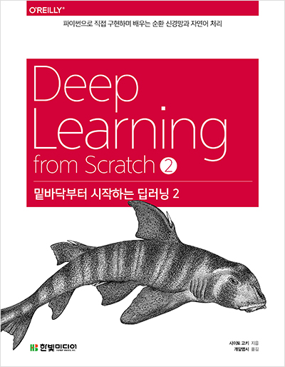

# Deep Learning from Scratch ❷

## 1. 교재

## 2. 목차

- 1장 - [신경망 복습](<https://github.com/ExcelsiorCJH/DLFromScratch2/blob/master/Chap01-Neural_Networks_Review/notebook.ipynb>)
- 2장 - [자연어와 단어의 분산 표현](<https://github.com/ExcelsiorCJH/DLFromScratch2/blob/master/Chap02-Natural_Language_and_Distributed_Representation/notebook.ipynb>)
- 3장 - [Word2Vec](<https://github.com/ExcelsiorCJH/DLFromScratch2/blob/master/Chap03-Word2Vec/notebook.ipynb>)
- 4장 - [Word2Vec 속도 개선](<https://github.com/ExcelsiorCJH/DLFromScratch2/blob/master/Chap04-Word2Vec_Improved/notebook.ipynb>)
- 5장 - [순환 신경망(RNN)](<https://github.com/ExcelsiorCJH/DLFromScratch2/blob/master/Chap05-Recurrent_Neural_Network/notebook.ipynb>)
- 6장 - [게이트가 추가된 RNN](https://nbviewer.jupyter.org/github/ExcelsiorCJH/DLFromScratch2/blob/master/Chap06-Fancy_RNN/notebook.ipynb)
- 7장 - [RNN을 사용한 문장 생성](https://nbviewer.jupyter.org/github/ExcelsiorCJH/DLFromScratch2/blob/master/Chap07-Seq2Seq/notebook.ipynb)
- 8장 - [어텐션(Attention)](https://nbviewer.jupyter.org/github/ExcelsiorCJH/DLFromScratch2/blob/master/Chap08-Attention/notebook.ipynb)

## 3. 참고자료

- **GitHub** :  <https://github.com/WegraLee/deep-learning-from-scratch-2>

- **errata** : <https://docs.google.com/document/d/1pzeh5nrP6y6A5WgT9vvxMpe-ai7ZRhU84BdAhdJzuFk/edit?usp=sharing>